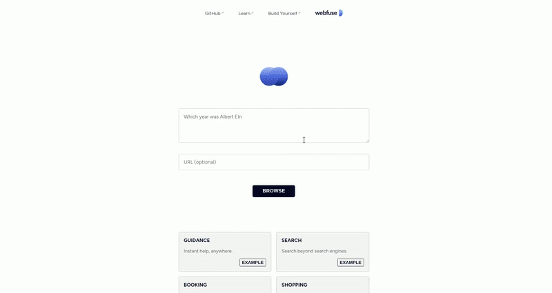

<p align="center">
  
</p>

<h1 align="center">Generalist Web Agent</h1>

<p align="center">
  <a href="https://webfuse.com"></a>
</p>

## Setup

1. Clone repository.<br>
2. Run <code>npm i</code>.<br>
3. Run <code>npm run bundle</code>.<br>
4. Update LLM provider authentication credentials to <code>dist/manifest.json</code>.<br>
5. Upload <code>dist</code> directory to Webfuse.

## .env

<sub><code>.env</code></sub>

``` .env
OPENAI_API_KEY=sk-proj-abcdef-012345
MODEL_NAME=gpt-4.1
MAX_ITERATIONS=5
DEBUG_LOGS=false
```

> To use a text-based DOM snapshot, instead of a GUI snapshot ('screenshot'): `DOM_SNAPSHOTS=false`.

## Example Tasks

Ask the agent...

- _"Go to W3 schools web IDE. Write a function that returns the first 10 Fibonacci numbers. Also run it."_
- _"Recommend a classy rain coat. It should have a blue color option. Not above 150 Euro, and in stock rn."_
- _"Show which team is currently 9th place of the Bundeliga."_

